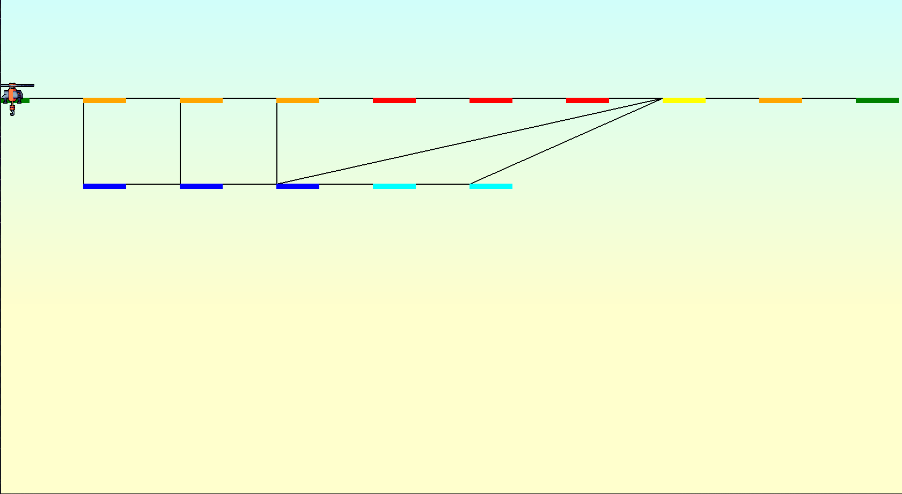
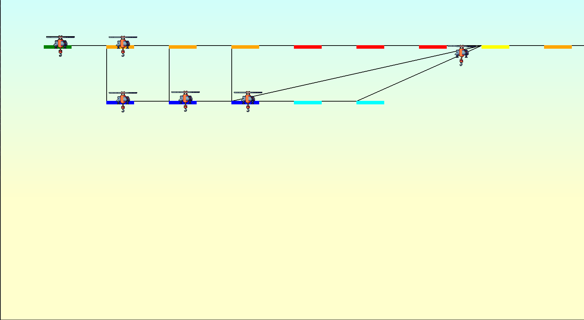

*This project has been created as part of the 42 curriculum by finorako.*

# FLY IN

<!--toc:start-->

- [FLY IN](#fly-in)
  - [DESCRIPTIONS](#descriptions)
  - [INSTRUCTIONS](#instructions)
  - [RESOURCES](#resources)
  - [AI USAGE](#ai-usage)
  - [Algorithm description](#description-of-the-algorithm)
  - [Visual representation](#visual-representation)
  <!--toc:end-->

## DESCRIPTIONS

Graph search algorithm, instead of a pure grid based search algorithm, so with this
project, we learned about them, because the way to solve them isn't quit the same
there are difference. For a graph search algorithm, we assume that the path to
the next hub has a weight, one of the reason I think of this proejct (help us
understand search algorithm better as well)

## INSTRUCTIONS

To run this program, you need to execute with the command bellow or just run:

- First of all, you need to run the command: `make install` this will install
all the dependecies it found inside the *pyproject.toml* file
- Without visualistion: `make run ARGS=<path_to_map>`
- With visualisation: `make visual ARGS=<path_to_map>`
- Using makefile is recommended but you can run it with
`uv run python codes --input <path_to_file>` or
`uv run python codes --input <path_to_file> --visual`

## RESOURCES

- [pygame](https://www.pygame.org/docs/)
- [TechWithTim](https://www.youtube.com/watch?v=JtiK0DOeI4A&t=4474s)
- [Clear Code](https://www.youtube.com/@ClearCode)
- [A* search algorithm](https://en.wikipedia.org/wiki/A*_search_algorithm)

### AI USAGE

The algorithm was a customisation of our bfs used to complete
our project **A-Mazing**, No IA was used to achieve it then.

### Description of the algorithm

For my algorithm, I customized our bfs algorithm used in our A-Mazing project.

How does it works. Let's say there are 4 Drones for example.
First of all, I put all the drones inside a list. I then
iterate through that list.

- - From the current zone of the current drone, I search for the optimal rout.
How do i search for that optimal rout:
- - first of all, i take the length of the neighbors of the current zone,
as I fill all those neighbor, i increment a `counter` the moment this
counter reach the length of the current zone's neighbors, i change
the value of the variable `starter`, why ? Because the next cell of the current
cell is the only one that interest as, the other one will just be filled. The reason
I do that, Let's say the one of the current zone's neighbors is full, we must search
for a new route, and verify if one of those neighbor has a cost
**step to reach goal** that is less than the one full, if yes, we skip the next
cell, and continue with that cell overwise, we wait for that cell to be free again.
- - After finding that path (if we found any) we reorder it so that, the path
we got start exactly from our current zone.
- - We then take the second element from the list we received from the path we got,
because that is the next cell, the first one is current cell (after
reconstruction of path)
- - Verifying if that path/connection is full, if yes we skip a turn, else we
verify if that cell is a restricted one or not, if yes, we directly increment
the number of drone inside the next zone, because if the hub it found is a
restricted one, it must go there by the next turn as stipulated by the subject,
we also increment the number of drone inside the connection. Otherwise, the
drone doesn't wait a turn to go to the next cell, it just go there
- - After that, we restart everything from the current zone we got from the
algorithm till the current zone of the drone is end zone, and after all that we
remove the drone from the list.

It is important to note that the way I put the current cell's neighbor in the stack
break the way how bfs work, as i reorder them, to be sorted by 'priority' and then
the cost to reach end zone.

## REPRESENTATION OF THE ALGORITHM

# Visual representation

For the visual representation, I used pygame, I think It can be improved but, I
just wanted to finish the project as fast as I can to take a little rest, So
that's why I went with this.

When The next hub the drone has chosen is a restricted one, it still be represented
on the current hub, but it will liberate that place, and in the next turn, it will
go the next cell (which was the restricted)

To visualize, you must do the command line: `make visual ARGS=<path_to_file>`

